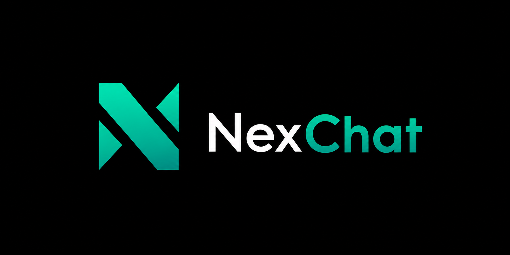

# NexChat

<p align="center">
  
</p>

A full-stack, WhatsApp-style messaging app with **end-to-end encryption**, real-time presence, group chats, media sharing, and push notifications.

---

## Tech Stack

**Backend**
- **Runtime:** Node.js + TypeScript (Express 5)
- **Database:** PostgreSQL via Prisma ORM
- **Realtime:** Socket.io with Redis adapter
- **Cache / Presence:** Redis (ioredis)
- **Auth:** Firebase (Google Sign-In) + JWT (access + refresh tokens) + OTP (email/SMS)
- **Media Storage:** Cloudflare R2 (S3-compatible)
- **Push Notifications:** Firebase Cloud Messaging (FCM)
- **Email:** Nodemailer / Resend
- **SMS:** Twilio
- **Validation:** Zod

**Frontend**
- **Framework:** React 19 + TypeScript + Vite
- **Routing:** React Router v7
- **State:** Zustand + TanStack Query v5
- **Realtime:** socket.io-client
- **UI:** Tailwind CSS v4 + Lucide React
- **Forms:** React Hook Form + Zod

---

## Features

- 🔐 **End-to-end encryption** — messages are encrypted client-side before storage; server never sees plaintext
- 💬 **Direct & group conversations** — group roles (admin / member), invite links
- ✏️ **Edit & delete messages** — edit your own text messages; delete for everyone
- 👍 **Reactions** — emoji reactions with per-reaction detail sheets
- ↩️ **Reply & forward** — threaded replies and cross-chat forwarding
- 📌 **Pin conversations** — per-user pinning
- ⭐ **Starred messages** — bookmark important messages across all chats
- 🔕 **Mute & archive** — per-user mute (8h / 1w / always) and archive
- 👁️ **Read receipts** — per-message read watermarks; configurable per-user
- 🟢 **Online presence** — live online/offline + last seen (with visibility controls)
- 🔔 **Push notifications** — FCM-based; bypasses mute for @mentions
- 📎 **Media** — images, video, audio, files; Cloudflare R2 storage
- 🔗 **Link previews** — server-side OG/Twitter tag fetching with SSRF protection
- ⏳ **Disappearing messages** — per-conversation TTL (24h / 7d / 90d); server sweep
- @️ **Mentions in groups** — `@` autocomplete; mentioned users always notified
- 🚫 **Block & report** — per-user block list with Redis cache
- 🖼️ **Media gallery** — browse shared images, docs, and links inside a chat
- 📋 **Per-conversation drafts** — persisted in localStorage
- 🐳 **Docker Compose** — one-command local stack (Postgres + Redis + app)

---

## Prerequisites

- Node.js ≥ 20
- PostgreSQL 15
- Redis 7
- A Cloudflare R2 bucket
- Firebase project (Auth + FCM service account)
- Twilio account (SMS OTP)
- SMTP credentials (email OTP)

> Docker users only need Docker Desktop — everything else is handled by `docker-compose.yml`.

---

## Getting Started

### 1. Clone & install

```bash
git clone https://github.com/your-username/nexchat.git
cd nexchat

# Backend
npm install

# Frontend
cd client && npm install && cd ..
```

### 2. Configure environment

```bash
cp .env.example .env
```

Fill in `.env` — see [Environment Variables](#environment-variables) below.

For the frontend:

```bash
cp client/.env.example client/.env
```

### 3. Start infrastructure (Docker)

```bash
docker-compose up -d postgres redis
```

Or run the full stack including the app:

```bash
docker-compose up -d
```

### 4. Database setup

```bash
npm run prisma:migrate   # run migrations
npm run prisma:generate  # generate Prisma client
npm run prisma:seed      # (optional) seed demo data
```

### 5. Run in development

```bash
# Terminal 1 — backend
npm run dev

# Terminal 2 — frontend
cd client && npm run dev
```

Backend: `http://localhost:3000`  
Frontend: `http://localhost:5173`

---

## Environment Variables

| Variable | Description |
|---|---|
| `DATABASE_URL` | PostgreSQL connection string |
| `REDIS_URL` | Redis connection string |
| `JWT_ACCESS_SECRET` | JWT access token secret |
| `JWT_REFRESH_SECRET` | JWT refresh token secret |
| `REQUIRE_OTP_VERIFICATION` | `true` to enforce OTP on registration |
| `R2_ACCOUNT_ID` | Cloudflare account ID |
| `R2_ACCESS_KEY` | R2 access key |
| `R2_SECRET_KEY` | R2 secret key |
| `R2_BUCKET` | R2 bucket name |
| `R2_PUBLIC_URL` | Public R2 base URL |
| `RESEND_API_KEY` | Resend API key (or use SMTP below) |
| `SMTP_HOST` / `SMTP_PORT` / `SMTP_USER` / `SMTP_PASS` | Nodemailer SMTP config |
| `TWILIO_ACCOUNT_SID` / `TWILIO_AUTH_TOKEN` / `TWILIO_PHONE_NUMBER` | Twilio SMS |
| `FCM_SERVICE_ACCOUNT_BASE64` | Base64-encoded Firebase service account JSON |

See `.env.example` for a complete reference.

---

## Project Structure

```
nexchat/
├── src/
│   ├── server.ts              # Express + Socket.io entry point
│   ├── config/                # DB, Redis, R2, Firebase, env
│   ├── middlewares/           # auth, validation, error handler
│   ├── modules/
│   │   ├── auth/              # register, login, OTP, Firebase sign-in
│   │   ├── users/             # profile, search, block, sessions
│   │   ├── conversations/     # CRUD, participants, settings
│   │   ├── messages/          # send, edit, delete, react, star, media
│   │   └── media/             # upload, link preview proxy
│   └── utils/                 # logger, email, SMS, presence, expiry sweep
├── client/
│   └── src/
│       ├── api/               # Axios API layer
│       ├── components/        # UI components
│       ├── hooks/             # Custom React hooks
│       ├── pages/             # Route-level pages
│       ├── store/             # Zustand stores
│       └── utils/             # Client-side crypto, helpers
├── prisma/
│   ├── schema.prisma
│   └── migrations/
├── docker-compose.yml
└── Dockerfile
```

---

## Docker (full stack)

```bash
docker-compose up -d
```

This starts Postgres 15, Redis 7, and the NexChat app on port `3000`. Update the environment variables in `docker-compose.yml` before deploying to production.

---

## Scripts

| Command | Description |
|---|---|
| `npm run dev` | Start backend with hot reload |
| `npm run build` | Compile TypeScript |
| `npm run start` | Start compiled backend |
| `npm run prisma:migrate` | Apply DB migrations |
| `npm run prisma:generate` | Regenerate Prisma client |
| `npm run prisma:seed` | Seed database |
| `cd client && npm run dev` | Start frontend dev server |
| `cd client && npm run build` | Build frontend for production |

---

## License

ISC
